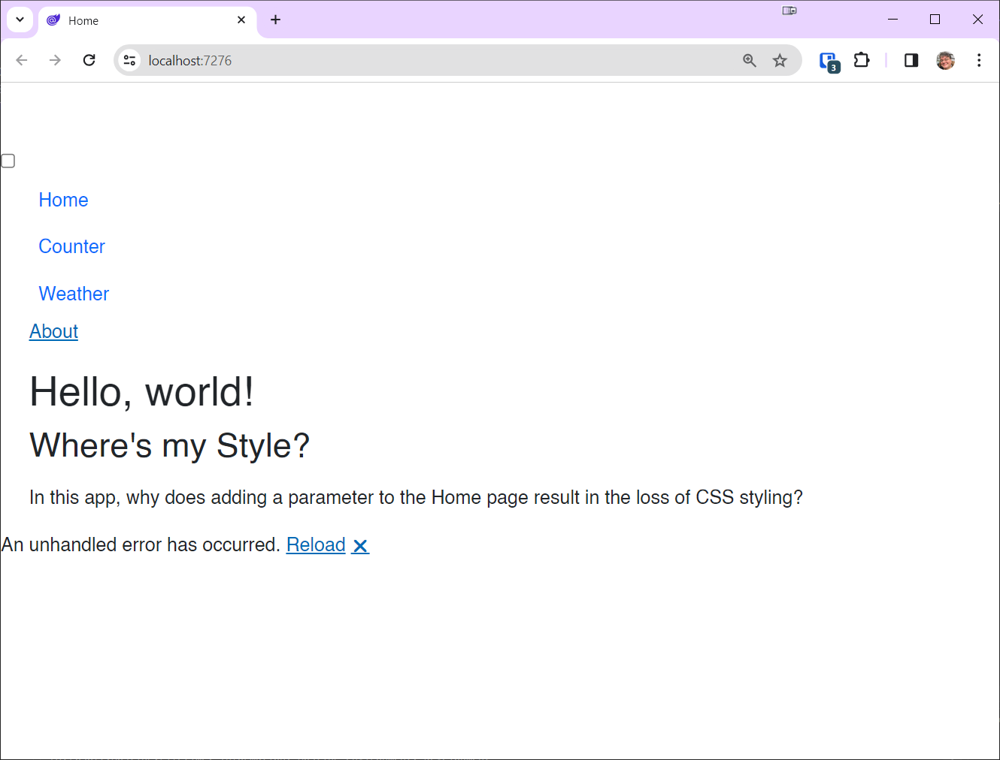

# Blazor Puzzle #30

## Where's the Layout?

YouTube Video: https://youtu.be/

Blazor Puzzle Home Page: https://blazorpuzzle.com

### The Challenge:

Carl and Jeff want to know why adding a parameter to the Home page results in the loss of CSS styling.

Given the following *Home.razor*:

```c#
@page "/"
@page "/{arg}"

<PageTitle>Home</PageTitle>

<h1>Hello, world!</h1>

<h2>Where's my Style?</h2>

<p>@Message</p>

<p>In this app, why does adding a parameter to the Home page result in the loss of CSS styling?</p>

@code {

    [Parameter]
    public string arg { get; set; }

    string Message = string.Empty;

    protected override void OnInitialized()
    {
        if (arg != null)
        {
            Message = $"Message: {arg}";
        }
    }
}
```

This is the result:



How can we fix this?
